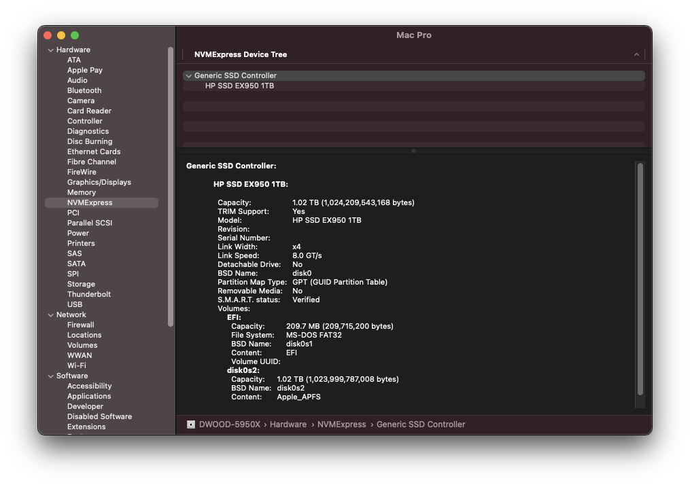

# HackPro: Gigabyte B450 I AORUS PRO WIFI


### System Specs
 - Display: Alienware AW3821DW (DisplayPort, 3840x1600@144Hz w/HDR)
 - GPU: AMD RX 460 2GB
 - CPU: AMD Ryzen 9 5950X
 - RAM: G.SKILL Aegis 32GB (2 x 16GB) DDR4-3200 / [F4-3200C16D-32GIS](https://www.newegg.com/g-skill-32gb-288-pin-ddr4-sdram/p/N82E16820232885)
 - MOBO: Gigabyte B450 I AORUS PRO WIFI (rev. 1.0)
   - WiFi: Replaced Intel WiFi with [BCM94360NG](https://www.ebay.com/sch/i.html?_from=R40&_nkw=BCM94360NG&_sacat=0&_sop=15&rt=nc&LH_PrefLoc=3)
   - Ethernet: Intel i211 Gigabit
   - Audio Codec: ALC1220
 - Storage: 
   - NVMe: [HP EX950 M.2 2280 1TB PCle Gen3 x4](https://www.newegg.com/hp-ex950-1tb/p/N82E16820326041)
   - SATA: Micron 5100 3.84TB SSD (MTFDDAK3T8TBY)
   - SATA: Micron M600 1TB SSD (MTFDDAK1T0MBF)

### Issues

Working:
 - Sleep
 - Handoff
 - Continuity
 - iMessages
 - FaceTime (Video and Audio) w/Logitech C920
 - Amazon Prime Video (Chrome)
 - Video Acceleration
 - AirPlay2 (LG UM7570PUB)
 - Quicklook
 - Bluetooth - Audio In/Out (Beats Flex)
 - Front Panel - Audio Out
 - Rear Panel - Audio Out
 - All USB 3 ports @ 5Gbps
 - SATA @ 6Gbps

Not Working:
 - Sidecar (Black screen on iPad)
 - Amazon Prime Video (Safari) 
   - Audio plays, video is just a red screen.
 - Rear Audio In (Mic)
 - Front Audio In (Mic)


### BIOS Version and Settings
Version: [F61a / 2021-03-29](https://www.gigabyte.com/us/Motherboard/B450-I-AORUS-PRO-WIFI-rev-10/support#support-dl-bios)

BIOS Settings (Reset BIOS to Factory and apply the following):
 - Secure Boot: Disabled
 - CSM: Disabled
 - Memory: XMP Profile 1 (DDR4-3200)
 - Network Boot: Disabled

These should already be set as default, but are important not to miss:
 - RESIZE BAR: Disabled
 - Above 4G: Disabled

### Apple SMBIOS
 - MacPro 7,1

### OpenCore Version
 - [0.6.7](https://github.com/acidanthera/opencorepkg/releases)

### Installed Kexts 
Note: There are no Intel WiFi/BT drivers below, I replaced that with the Broadcom BCM94360NG.

| Kext | Release Date | Website|
| --- | --- | ---|
| AMDRyzenCPUPowerManagement.kext | 2020-11-20 | https://github.com/trulyspinach/SMCAMDProcessor/releases |
| SMCAMDProcessor.kext | 2020-05-26 | https://github.com/trulyspinach/SMCAMDProcessor/releases |
| AppleALC.kext | 2021-03-01 | https://github.com/acidanthera/applealc/releases |
| AppleMCEReporterDisabler.kext | --- | https://github.com/acidanthera/bugtracker/files/3703498/AppleMCEReporterDisabler.kext.zip |
| CtlnaAHCIPort.kext | 2020-08-22 | https://github.com/dortania/OpenCore-Install-Guide/blob/master/extra-files/CtlnaAHCIPort.kext.zip |
| Lilu.kext | 2021-02-02 | https://github.com/acidanthera/lilu/releases|
| SmallTreeIntel82576.kext | 2020-04-16 | https://github.com/khronokernel/SmallTree-I211-AT-patch/releases |
| VirtualSMC.kext | 2021-03-01 | https://github.com/acidanthera/virtualsmc/releases |
| WhateverGreen.kext | 2021-03-01 | https://github.com/acidanthera/whatevergreen/releases |
| RestrictEvents.kext | 2021-01-04 | https://github.com/acidanthera/RestrictEvents/releases |
| USBMap.kext | Generated | https://github.com/corpnewt/USBMap |

### Screenshots





### USBMap
```
    ----- PTXH@0 Controller -----
[#] 1. POT1 | AppleUSB30XHCIPort | 00100000 | Type 3
    RP-31-2
[#] 2. POT2 | AppleUSB30XHCIPort | 00200000 | Type 3
    RP-31-1
[#] 3. POT3 | AppleUSB30XHCIPort | 00300000 | Type 3
    FP-1
[#] 4. POT4 | AppleUSB30XHCIPort | 00400000 | Type 3
    FP-2
[#] 5. POT5 | AppleUSB20XHCIPort | 00500000 | Type 3
    RP-20-2
[#] 6. POT6 | AppleUSB20XHCIPort | 00600000 | Type 3
    RP-20-1
[#] 7. POT7 | AppleUSB20XHCIPort | 00700000 | Type 3
    FP-20-1
[#] 8. POT8 | AppleUSB20XHCIPort | 00800000 | Type 3
    FP-20-2
[ ] 9. POT9 | AppleUSB20XHCIPort | 00900000 | Type 3
    UNKNOWN
[ ] 10. PO10 | AppleUSB20XHCIPort | 00a00000 | Type 3
    UNKNOWN
[ ] 11. PO11 | AppleUSB20XHCIPort | 00b00000 | Type 3
    UNKNOWN
[ ] 12. PO12 | AppleUSB20XHCIPort | 00c00000 | Type 3
    UNKNOWN
[ ] 13. PO13 | AppleUSB20XHCIPort | 00d00000 | Type 3
    UNKNOWN
[#] 14. PO14 | AppleUSB20XHCIPort | 00e00000 | Type 3
    m.2 Slot for WiFi

    ----- XHC0@0,3 Controller -----
[#] 15. AppleUSB20XHCIPort | AppleUSB20XHCIPort | 60100000 | Type 3
    ETH-20-2
[#] 16. AppleUSB20XHCIPort | AppleUSB20XHCIPort | 60200000 | Type 3
    ETH-20-1
[#] 17. AppleUSB20XHCIPort | AppleUSB20XHCIPort | 60300000 | Type 3
    HDMI-20-2
[#] 18. AppleUSB20XHCIPort | AppleUSB20XHCIPort | 60400000 | Type 3
    HDMI-20-1
[#] 19. AppleUSB30XHCIPort | AppleUSB30XHCIPort | 60500000 | Type 3
    ETH-30-2
[#] 20. AppleUSB30XHCIPort | AppleUSB30XHCIPort | 60600000 | Type 3
    ETH-30-1
[#] 21. AppleUSB30XHCIPort | AppleUSB30XHCIPort | 60700000 | Type 3
    HDMI-30-2
[#] 22. AppleUSB30XHCIPort | AppleUSB30XHCIPort | 60800000 | Type 3
    HDMI-30-1
```


### Sanitization script
```bash
plistOriginal='/Volumes/EFI/EFI/OC/config.plist'
plistPath='/Volumes/EFI/EFI/OC/config-sanitized.plist'
cp -f "${plistOriginal}" "${plistPath}"

clearedFields=('SystemSerialNumber' 'SystemUUID' 'MLB' 'ROM')
for clearedField in ${clearedFields[@]}; do
  /usr/libexec/PlistBuddy -c "Set :PlatformInfo:Generic:${clearedField} 0" "${plistPath}"
done

/usr/libexec/PlistBuddy -c "Print :PlatformInfo:Generic" "${plistPath}"
```